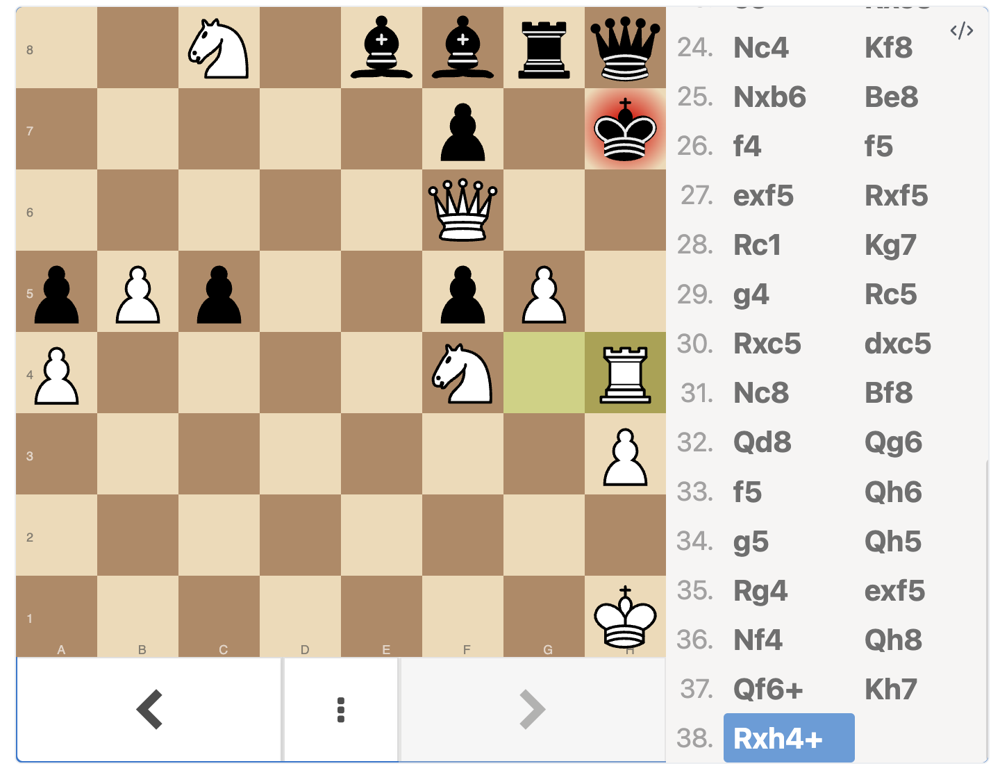

# Obsidian PGN Viewer Plugin

This is a plugin for Obsidian (https://obsidian.md).

This project uses Typescript and and provides a code block for viewing and interacting with chess games in PGN format.

There are other chess plugins for Obsidian, but I wanted to be able to view and interact with PGN files, with variations, in a code block. This plugin uses the [Lichess pgn viewer](https://github.com/lichess-org/pgn-viewer), and is essentially just that viewer adapted for Obsidian. Currently, I think this is the only one that accomplishes that goal.

The intention is for taking notes about games and playing through them. This is not a plugin for playing chess, or editing or creating PGN files - just viewing them, although maybe such functionality could be added in the future.

## Usage:

Put the PGN file in a code block with the language set to `pgn`. The plugin will then render the game in the code block.

````
```pgn
1.e4 c5 2.Nf3 d6 3.Bb5+ Nd7 4.d4 Nf6 5.O-O cxd4 6.Qxd4 a6
7.Bxd7+ Bxd7 8.Bg5 h6 9.Bxf6 gxf6 10.c4 e6 11.Nc3 Rc8 12.Kh1 h5
13.a4 h4 14.h3 Be7 15.b4 a5 16.b5 Qc7 17.Nd2 Qc5 18.Qd3 Rg8
19.Rae1 Qg5 20.Rg1 Qf4 21.Ref1 b6 22.Ne2 Qh6 23.c5 Rxc5
24.Nc4 Kf8 25.Nxb6 Be8 26.f4 f5 27.exf5 Rxf5 28.Rc1 Kg7
29.g4 Rc5 30.Rxc5 dxc5 31.Nc8 Bf8 32.Qd8 Qg6 33.f5 Qh6
34.g5 Qh5 35.Rg4 exf5 36.Nf4 Qh8 37.Qf6+ Kh7 38.Rxh4+ 1-0
```
````

becomes...



no editing for now.

#### notes for me:

Publish the release.

> You can simplify the version bump process by running npm version patch, npm version minor or npm version major after updating minAppVersion manually in manifest.json. The command will bump version in manifest.json and package.json, and add the entry for the new version to versions.json
